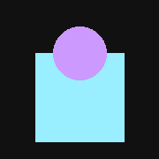
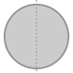
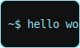

<!-- Profile Header -->

  

  <h1 style="font-family: 'Courier New', monospace; font-size: 32px; color: #ccf; margin-top: 10px;">
    ✨ Kashish Aggarwal (@kashkeeps)
  </h1>

  

    Aspiring Full Stack dev | cat lover 🐱 | building cool stuff with curiosity 💫
  

  

    “dream it, code it, git it girl”
  

---

## 🌌 About Me

- 🧠 Python & C enthusiast  
- 🐬 Databases: MySQL & Supabase  
- 🤖 Playing with Gemini AI & Prompt Engineering  
- 💻 Exploring ML basics: Classification, Regression, Pipelines  
- ⚙️ Dev Tools: Git, GitHub, Linux, VS Code, Postman  
- 🌈 Dreaming in pixels, coding in color  

---

## 🌟 Skills at a Glance

  

---

## 🛸 Featured Projects

  <a href="https://github.com/kashkeeps?tab=repositories" style="text-decoration: none;">
    

      <strong>🌈 Check out my Projects</strong> 
      Hover to explore my pixel dev world!
    

  </a>

---

## 🏆 Achievements

  

---

## 🔮 GitHub Stats

  
  

---

## 🎨 Neon Pixel Effects

  
  
  
  

---

## 📬 Connect with Me

  
  

---

  

